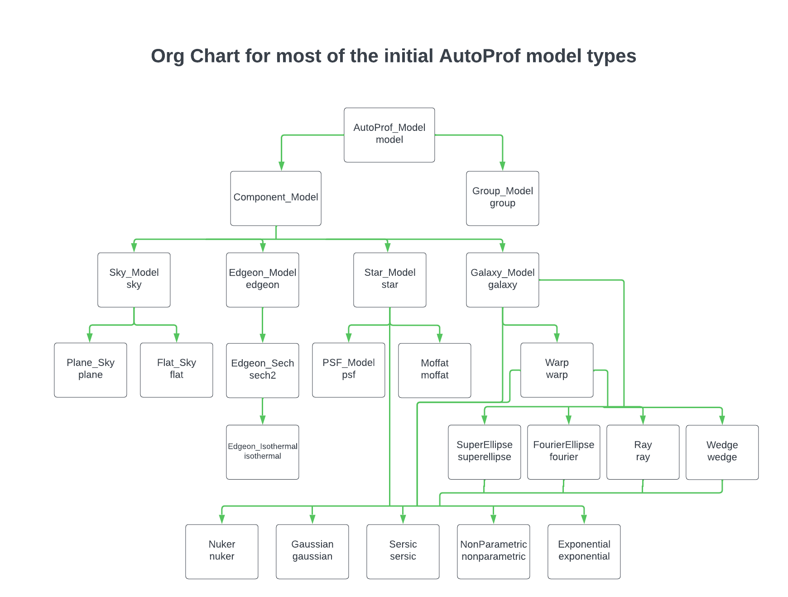

AutoProf is a python based astronomical image modelling code. It is highly flexible for a wide range of analysis tasks and uses pytorch to accelerate calculations with automatic exact derivatives and either parallel CPU code, or by taking advantage of GPUs. While pytorch was developped for Machine Learning, AutoProf hijacks its capabilities for regular Chi squared minimization and so is not a Machine Learning tool itself. Written by [Connor Stone](https://connorjstone.com/), AutoProf was developped for a number of science goals such as LSB imaging, handling crowded fields, simultaneous multi-band image modelling, and dealing with massive volumes of data from the next generation of telescopes. Even if you aren't pushing these boundaries in particular, you will likely find AutoProf fast and easy to use for any astronomical image modelling task.

## Installation

AutoProf can be pip installed with:

```
pip install autoprof
```

However, for AutoProf to run you will need to install pytorch as well. Installing pytorch is very user specific, though also not very hard. Follow the instructions on the [pytorch website](https://pytorch.org/) to install a version for your system.

Also note that AutoProf is only available for python3.

You can fork the GitHub if you want to do some serious customization, everything will be in the `autoprof` directory once you download the source.

## Getting started

The easiest way to get started using AutoProf is to try running the jupyter notebook tutorials. Simply make a new directory where you want to run the tutorials then run the:

```
autoprof tutorials
```

command to download the AutoProf tutorials. If you run into difficulty with this, you can also access the tutorials directly at [this link](https://github.com/ConnorStoneAstro/AutoProf-2/tree/main/docs/tutorials) to download. Once you have the tutorials, start a jupyter session and run through them. The recommended order is:

1. GettingStarted
1. GroupModels
1. ModelZoo
1. JointModels
1. CustomModels (if you're feeling bold)

## Documentation

You can find the documentation at [this site](https://connorstoneastro.github.io/AutoProf-2/) which covers many of the main use cases for AutoProf. For more advanced situations feel free to contact the author [Connor Stone](https://connorjstone.com/) for any questions not answered by the documentation or tutorials.

## Model Org Chart

As a quick reference for what kinds of models are available in AutoProf, the org chart shows you the class hierarchy where the leaf nodes at the bottom are the models that can actually be used. Following different paths through the hierarchy gives models with different properties. Just use the second line at each step in the flow chart to construct the name. For example one could follow a fairly direct path to get a `sersic galaxy model`, or a more complex path to get a `muker fourier warp galaxy model`. Note that the `Base_Model` object doesn't have an identifier, it is really meant to hide in the background while its subclasses do the work.



## Credit / Citation

If you use AutoProf in your research, please credit the author by citing: [ADS Bibliographic Record](https://ui.adsabs.harvard.edu/abs/2021MNRAS.508.1870S/abstract). A new paper for the updated AutoProf code is in the works.